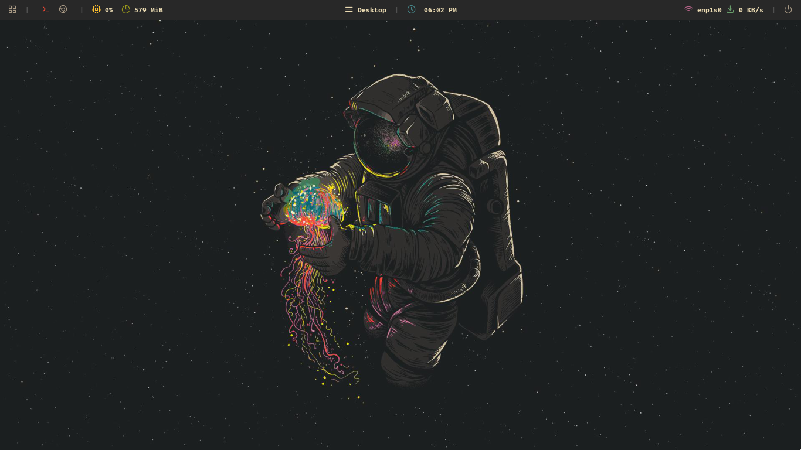
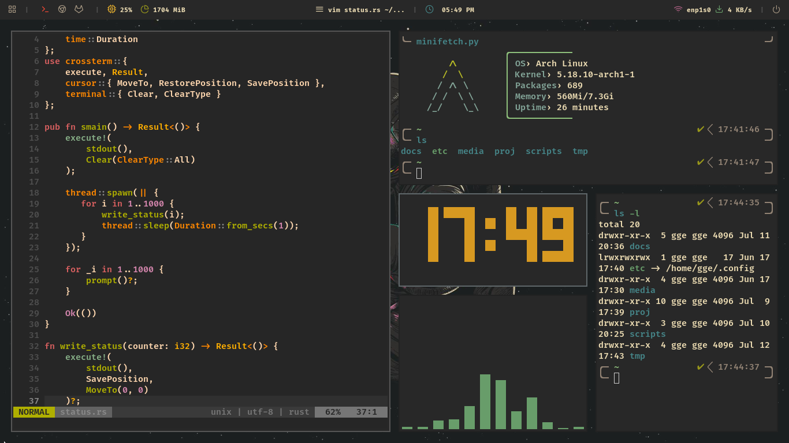
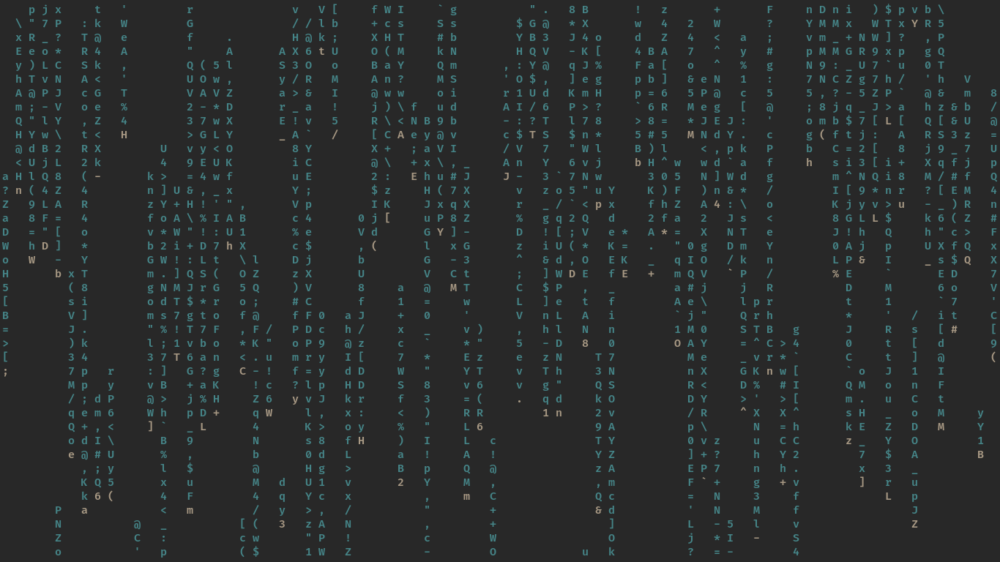
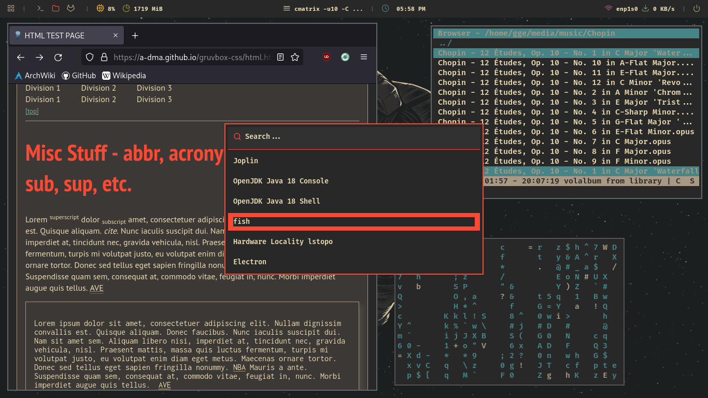
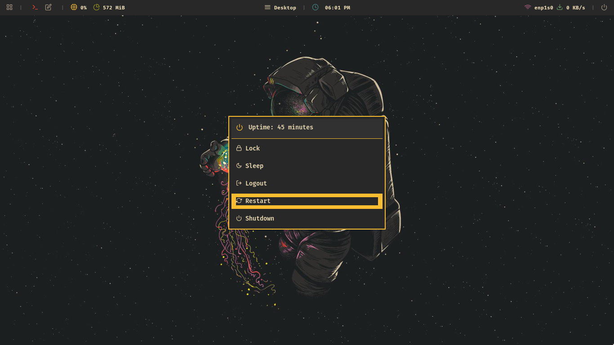

>[!NOTE]
> This repo has been archived, I no longer daily drive Arch or use this configuration. I've since switched to NixOS. New config maintained [here](https://github.com/ggemre/nixos-config).

# arch_dotfiles

The dotfiles and other configuration info for arch setup for my own future reference.

Each package was made by others. I just configured them and wrote some useful scripts. I will do my best to link to each component I used and to give credit.

---

Main specs:

- **os** : [archlinux](https://wiki.archlinux.org/) 
- **login manager** : [ly](https://github.com/fairyglade/ly)
- **wm** : [i3-gaps](https://github.com/Airblader/i3)
- **statusbar** : [polybar](https://github.com/polybar/polybar)
- **menu** : [rofi](https://github.com/davatorium/rofi)
- **terminal** : [kitty](https://github.com/kovidgoyal/kitty)
- **editor** : [neovim](https://github.com/neovim/neovim)
- **shell** : [fish](https://github.com/fish-shell/fish-shell)
- **theme** : [gruvbox](https://github.com/morhetz/gruvbox)
- **browser** : [firefox](https://www.mozilla.org/en-US/firefox/new/) (hardened)

---

Empty workspace screenshot:

---

### Installing

==COMING SOON== I will provide an install script soon (for myself to set up temporary virtual environments)

---

Busy workspace screenshot:

Notes on configuration:
- rofi accents with a random color on every launch, affecting the launcher and powermenu
- screensaver is set to a random color on every launch
- tty-clock is set to a random color when launched with "clock" alias
- fish uses the [tide](https://github.com/IlanCosman/tide) prompt

Custom screensaver (using [cmatrix](https://github.com/abishekvashok/cmatrix)). Can be called from commandline or from powermenu (rofi). Will trigger automatically after 8 minutes of inactivity:

Additional screenshot:

### Polybar and Rofi config:

For polybar - inspired by [polybar-themes](https://github.com/adi1090x/polybar-themes), specifically the [forest](https://github.com/adi1090x/polybar-themes/blob/master/README.md#Forest) theme, of which I borrowed a lot of modules from to create my "gruvbar" bar.

For rofi - ideas, scripts, and features taken from both this [rofi theme collection](https://github.com/adi1090x/rofi) and from this [setup here](https://github.com/adi1090x/polybar-themes).

### Fonts:

The kitty terminal was chosen for ligature support, (project originally used alacritty). Main font is [fira code](https://github.com/tonsky/FiraCode). Nerd font icons are used.

- [FiraCode](https://www.nerdfonts.com/) (for everything, I always set to "semibold")
- [Microsoft fonts](https://aur.archlinux.org/packages/ttf-ms-fonts) (certain apps)
- [Noto fonts](https://github.com/notofonts/noto-fonts) (for emojis :smile:)

### Plugin info:

- [fisher](https://github.com/jorgebucaran/fisher) plugin manager for fish
  - [tide](https://github.com/IlanCosman/tide) fish plugin for prompt
- [vim-plug](https://github.com/junegunn/vim-plug) plugin manager for vim
  - [gruvbox-material](https://github.com/sainnhe/gruvbox-material) vim plugin for gruvbox theme
  - [vim-devicons](https://github.com/ryanoasis/vim-devicons) vim plugin for devicons
  - [nerdtree](https://github.com/preservim/nerdtree) vim plugin for file navigation
  - [vim-startify](https://github.com/mhinz/vim-startify) vim plugin for welcome screen
  - [coc.nvim](https://github.com/neoclide/coc.nvim) vim plugin for all of my autocompletion, linting, and more
  - [nerdcommenter](https://github.com/perservim/nerdcommenter) vim plugin for comments
  - [vim-snippets](https://github.com/honza/vim-snippets) vim plugin for snippets
  - [lightline](https://github.com/itchyny/lightline.vim) vim plugin for statusline

---

**Note:** screenshots may be slightly outdated at this time. (I am actively updating right now).
