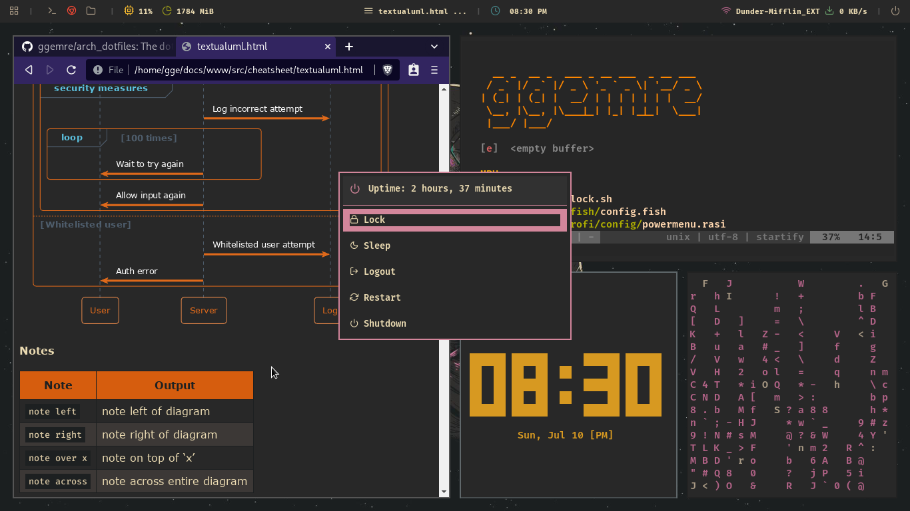

# arch_dotfiles

The dotfiles and other configuration info for arch setup for my own future reference.

- **os** : [archlinux](https://wiki.archlinux.org/) 
- **login manager** : [ly](https://github.com/fairyglade/ly)
- **wm** : [i3-gaps](https://github.com/Airblader/i3)
- **statusbar** : [polybar](https://github.com/polybar/polybar)
- **menu** : [rofi](https://github.com/davatorium/rofi)
- **editor** : [neovim](https://github.com/neovim/neovim)
- **shell** : [fish](https://github.com/fish-shell/fish-shell)

**Note:** screenshots are slightly outdated at this time. (I am currently updating right now).
